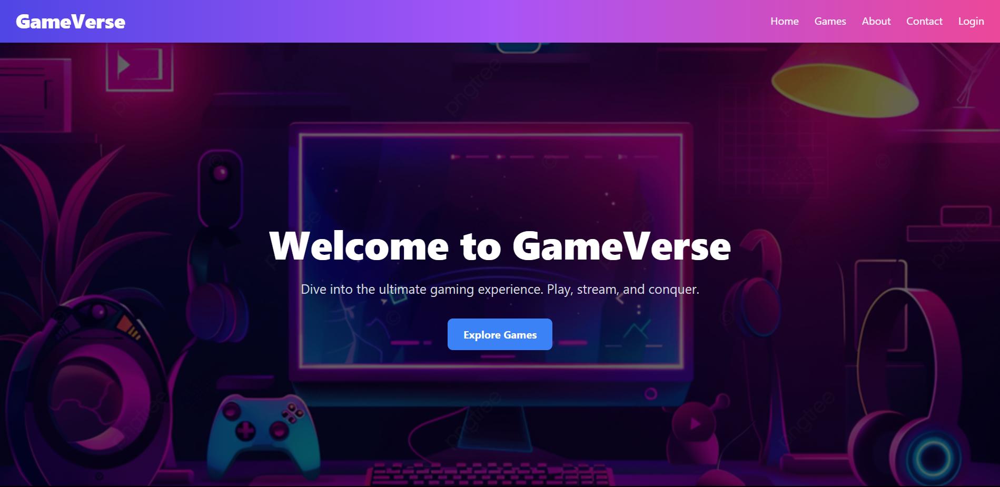
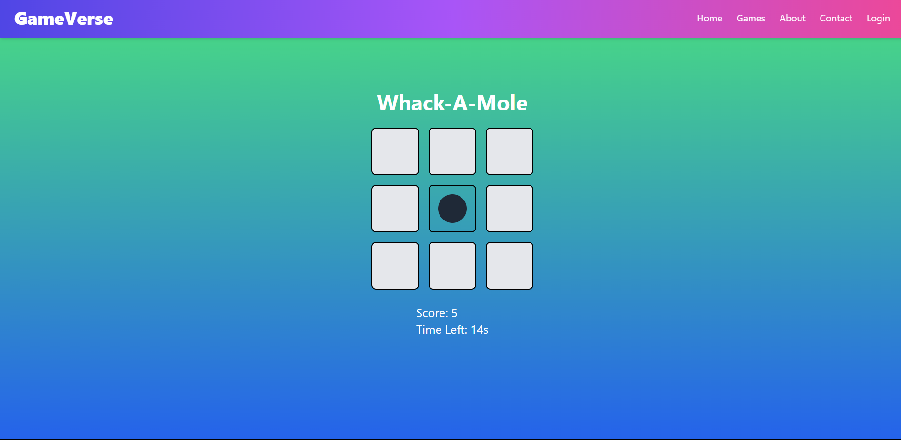

# **GameVerse**  
🎮 **The Ultimate Gaming Hub** 🎮  

GameVerse is a modern, feature-rich gaming website built with **ReactJS** and **Tailwind CSS**, offering a variety of engaging games and interactive user experiences. It's designed to be fully responsive and user-friendly, making it the perfect platform for casual gaming.  

---

## 🚀 **Features**  

- **Dynamic Home Page**:  
  - Eye-catching design with smooth animations.  
  - Intuitive navigation for seamless browsing.  

- **User Authentication**:  
  - Login with name, age, and password validation.  
  - Logged-in user's name displayed in the navbar with a dropdown for logout.  

- **Gaming Section**:  
  - A collection of fun and challenging games.  
  - Each game has unique features and custom logic.  

- **Interactive Pages**:  
  - Detailed **About Us** page.  
  - Functional **Contact Us** form.  

- **Responsive Design**:  
  - Fully optimized for desktop, tablet, and mobile devices.  

---

## 🎮 **Games Available**  

1. **Tic Tac Toe**:  
   - Multiplayer mode with score tracking.  
   - Restart and draw functionality.  

2. **Snake Game**:  
   - Classic arcade game with smooth controls.  

3. **Rock Paper Scissors**:  
   - Play against the computer with randomized outcomes.  

4. **Memory Card Game**:  
   - Match cards to test your memory.  

5. **Typing Speed Test**:  
   - Measure and improve your typing speed with real-time feedback.  

6. **Whack-A-Mole**:  
   - Test your reflexes by clicking moles within the time limit.  

7. **Guess the Word**:  
   - Random word guessing game with dynamic difficulty.  
 
8. **Number Guessing Game**:  
    - Guess the randomly generated number with helpful hints.  

---

## 📄 **Pages**  

- **Home Page**:  
  Features a dynamic hero section and navigation.  

- **About Us**:  
  Describes the purpose, features, and vision of the platform.  

- **Contact Us**:  
  Includes a form to collect user feedback or queries.  

- **Games Section**:  
  Displays all available games in an attractive card-based layout.  

---

## 🛠 **Technologies Used**  

- **ReactJS**: For building reusable components and dynamic functionality.  
- **Tailwind CSS**: For styling and responsive design.  
- **React Router**: For seamless page navigation.  
- **JavaScript**: For game logic and interactivity.  

---

## 💻 **Installation**  

1. Clone this repository:  
   ```bash
   git clone https://github.com/your-username/GameVerse.git
   cd GameVerse
2. Install dependencies:
    ```bash
    npm install
3.  Start the development server:
    ```bash
    npm start
4. Open [http://localhost:3000] in your browser to start exploring GameVerse.

---

## 🖼 Screenshots  

### Home Page  
  

## 🎮 Games Section  

### Preview of Games  

<table>
  <tr>
    <td align="center">
      
      <br>
      <b>Tic Tac Toe</b>
    </td>
    <td align="center">
      
      <br>
      <b>Snake Game</b>
    </td>
    <td align="center">
      
      <br>
      <b>Memory Game</b>
    </td>
  </tr>
  <tr>
    <td align="center">
      
      <br>
      <b>Typing Speed Test</b>
    </td>
    <td align="center">
      
      <br>
      <b>Whack-A-Mole</b>
    </td>
    <td align="center">
      
      <br>
      <b>Guess The Word</b>
    </td>
  </tr>
  <tr>
    <td align="center">
      
      <br>
      <b>Rock Paper Scissors</b>
    </td>
    <td align="center">
      
      <br>
      <b>Guess The Number</b>
    </td>
  </tr>
</table>
---

## 🌟 Future Enhancements
- Add more games to expand the library.
- Introduce a global leaderboard for score tracking.
- Include multiplayer options for select games.
- Personalize user profiles with stats and achievements.
---

## 🤝 Contributing
**Contributions are welcome! To contribute:**

1. Fork the repository.
2. Create a new branch for your feature.
3. Commit and push your changes.
4. Submit a pull request for review.
---

## 🎉 Enjoy Gaming with GameVerse!
Feel free to explore, play, and share your thoughts on this exciting gaming platform.

